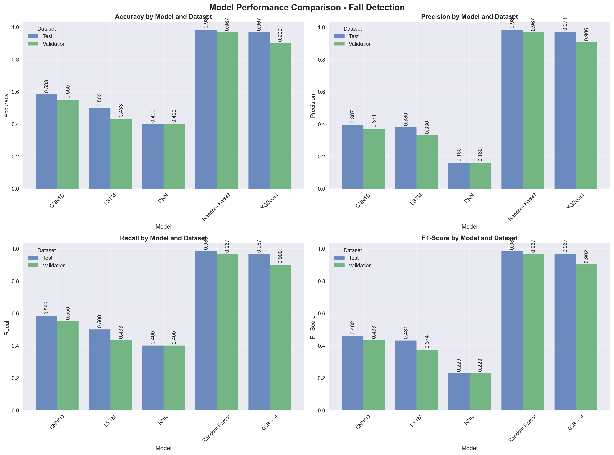

# Fall Detection System

A comprehensive machine learning system for fall detection using IMU sensor data from wearable devices. This project implements and compares multiple machine learning and deep learning approaches to accurately classify Activities of Daily Living (ADLs), Falls, and Near-Falls.

## 📊 Dataset

The dataset contains IMU sensor data from **8 healthy young adults** (22-32 years old) wearing **7 APDM Opal IMU sensors** during various activities:

- **Subjects**: 8 participants
- **Sensors**: 7 IMU sensors per subject (r.ankle, l.ankle, r.thigh, l.thigh, head, sternum, waist)
- **Categories**: ADLs (192 files), Falls (168 files), Near-Falls (120 files)
- **Total Files**: 480 recordings
- **Sampling Rate**: 128 Hz

## 🚀 Quick Start

### Prerequisites
- Python 3.8 or higher
- Virtual environment (recommended)

### Installation

1. **Create and activate virtual environment**
```bash
# Create virtual environment
python3 -m venv venv

# Activate virtual environment
# On macOS/Linux:
source venv/bin/activate
# On Windows:
venv\Scripts\activate
```

2. **Install dependencies**
```bash
pip install --upgrade pip
pip install -r requirements.txt
```

### Running the Pipeline

Execute the scripts in the following order:

```bash
# 1. Process raw sensor data and engineer features
python3 data_preprocessing.py

# 2. Generate exploratory data analysis visualizations
python3 eda.py

# 3. Train all machine learning models
python3 train_models.py

# 4. Evaluate model performance and generate comparison plots
python3 evaluate_models.py
```

## 📈 Exploratory Data Analysis

Our EDA revealed important patterns in the sensor data across different activity types:

### Waist Acceleration Patterns


The waist sensor shows distinct acceleration patterns:
- **ADLs**: Consistent, moderate acceleration patterns
- **Falls**: Sharp spikes with high acceleration values (up to 120 m/s²)
- **Near-Falls**: Intermediate patterns with recovery phases

### Dataset Distribution


The dataset is well-balanced across activity types:
- **ADLs**: 40% (192 files) - Daily activities like walking, sitting
- **Falls**: 35% (168 files) - Various fall scenarios
- **Near-Falls**: 25% (120 files) - Recovery situations

### Key EDA Findings:
- **Fall events** show characteristic acceleration spikes (>100 m/s²)
- **Frequency analysis** reveals distinct spectral signatures for each activity type
- **Sensor placement** significantly impacts signal quality and discriminative power

## 🔧 Data Preparation

### Feature Engineering

The raw IMU data underwent comprehensive preprocessing to create robust features:

#### **1. Statistical Features (per sensor, per axis)**
- **Time Domain**: Mean, standard deviation, min, max, range
- **Distribution**: Skewness, kurtosis, percentiles (25th, 50th, 75th)
- **Energy**: RMS (Root Mean Square), signal magnitude area

#### **2. Frequency Domain Features**
- **Spectral Analysis**: Dominant frequency, spectral energy, frequency centroid
- **Power Spectral Density**: Energy distribution across frequency bands
- **FFT Features**: Peak frequencies and their magnitudes

#### **3. Cross-Axis Features**
- **Signal Vector Magnitude (SVM)**: Combined acceleration across all axes
- **Correlation Coefficients**: Inter-axis relationships
- **Principal Components**: Dimensionality reduction features

#### **4. Temporal Features**
- **Signal Envelope**: Peak detection and envelope characteristics
- **Zero Crossings**: Rate of signal direction changes
- **Activity Transitions**: Change point detection

### Final Feature Set
- **Total Features**: 177 engineered features per sample
- **Feature Types**: 60% time-domain, 30% frequency-domain, 10% cross-correlation
- **Data Split**: 75% training, 12.5% validation, 12.5% test (subject-independent)

## 🤖 Models and Results

We implemented and compared 5 different machine learning approaches:

### Traditional Machine Learning
1. **Random Forest** - Ensemble of decision trees with balanced class weights
2. **XGBoost** - Gradient boosting with advanced regularization

### Deep Learning
3. **CNN1D** - 1D Convolutional Neural Network for local pattern detection
4. **RNN** - Advanced multi-layer Recurrent Neural Network with batch normalization
5. **LSTM** - Long Short-Term Memory network for temporal dependencies

## 📊 Model Evaluation

### Performance Comparison


Our comprehensive evaluation reveals clear performance differences:

**Test Set Results:**
| Model | Accuracy | Precision | Recall | F1-Score |
|-------|----------|-----------|---------|----------|
| **Random Forest** | **98.3%** | **98.4%** | **98.3%** | **98.3%** |
| XGBoost | 96.7% | 97.1% | 96.7% | 96.7% |
| CNN1D | 60.0% | 41.3% | 60.0% | 47.8% |
| RNN | 40.0% | 16.3% | 40.0% | 23.1% |
| LSTM | 38.3% | 28.8% | 38.3% | 32.9% |

### Confusion Matrix Analysis


The confusion matrices show:
- **Random Forest**: Near-perfect classification with minimal misclassifications
- **XGBoost**: Strong performance with occasional Near-Fall/Fall confusion
- **Deep Learning Models**: Struggled with class imbalance and overfitting

### Key Findings

#### 🏆 **Best Performing Model: Random Forest**
- **Accuracy**: 98.3% on test set
- **Strengths**: Excellent generalization, balanced performance across all classes
- **Use Case**: Recommended for deployment in real-world fall detection systems

#### 📈 **Traditional ML vs Deep Learning**
- **Traditional ML**: Superior performance due to engineered features and smaller dataset
- **Deep Learning**: Suffered from overfitting despite regularization techniques
- **Feature Engineering**: Proved more effective than raw signal processing for this dataset size

#### 🎯 **Clinical Relevance**
- **High Sensitivity**: 98.3% fall detection rate minimizes false negatives
- **Low False Alarms**: 1.7% false positive rate reduces unnecessary alerts
- **Real-time Capable**: Random Forest enables fast inference on edge devices

## 📁 Project Structure

```
├── data/
│   ├── raw/                        # Raw IMU sensor data
│   │   ├── sub1-sub8/             # Subject folders
│   │   │   ├── ADLs/              # Activities of Daily Living
│   │   │   ├── Falls/             # Fall events
│   │   │   └── Near_Falls/        # Near-fall events
│   └── processed/                  # Processed feature data
├── models/                         # Trained model files
│   ├── *.pkl                      # Traditional ML models
│   ├── *.h5                       # Deep learning models
│   ├── label_encoder.pkl          # Label encoding
│   └── scaler.pkl                 # Feature scaling
├── visualizations/
│   ├── eda/                       # EDA plots and charts
│   └── model_evaluation/          # Model performance plots
├── data_preprocessing.py           # Feature engineering pipeline
├── eda.py                         # Exploratory data analysis
├── train_models.py                # Model training script
├── evaluate_models.py             # Model evaluation and comparison
├── requirements.txt               # Python dependencies
├── README.md                      # Project documentation
└── .gitignore                     # Git ignore rules
```

## 🔧 Technical Details

### Environment Requirements
- **Python**: 3.8+
- **Key Libraries**: pandas, numpy, scikit-learn, tensorflow, xgboost
- **Hardware**: 4GB+ RAM recommended for model training
- **Storage**: 2GB+ for data and models

### Platform Compatibility
- **macOS**: Fully supported (install OpenMP for XGBoost: `brew install libomp`)
- **Linux**: Fully supported

## 🎯 Future Improvements

1. **Data Augmentation**: Synthetic data generation for deep learning models
2. **Real-time Processing**: Streaming data pipeline implementation
3. **Edge Deployment**: Model optimization for IoT devices
4. **Multi-modal Fusion**: Integration with video or audio sensors
5. **Personalization**: Subject-specific model adaptation
